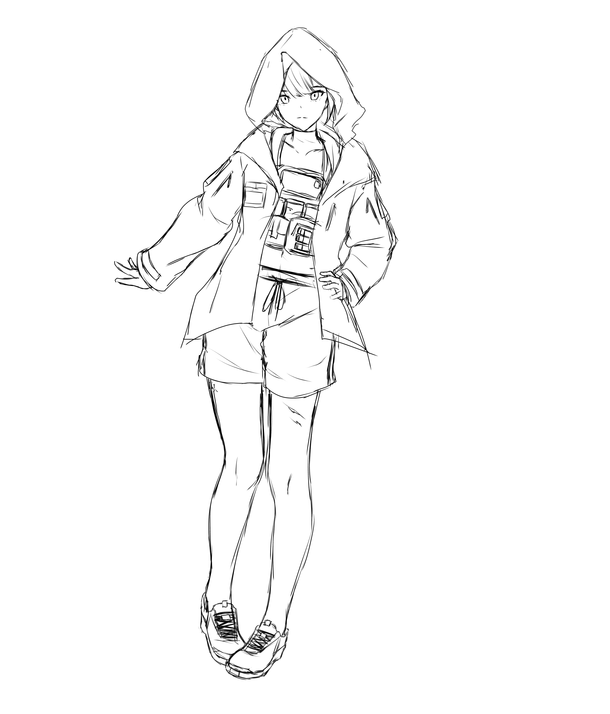
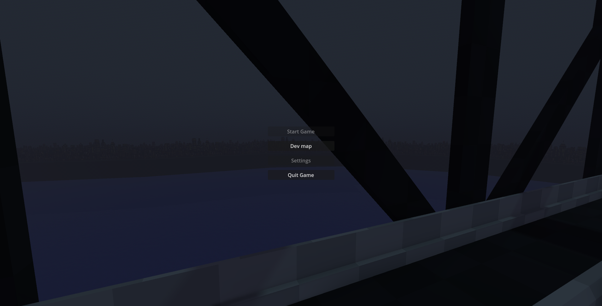
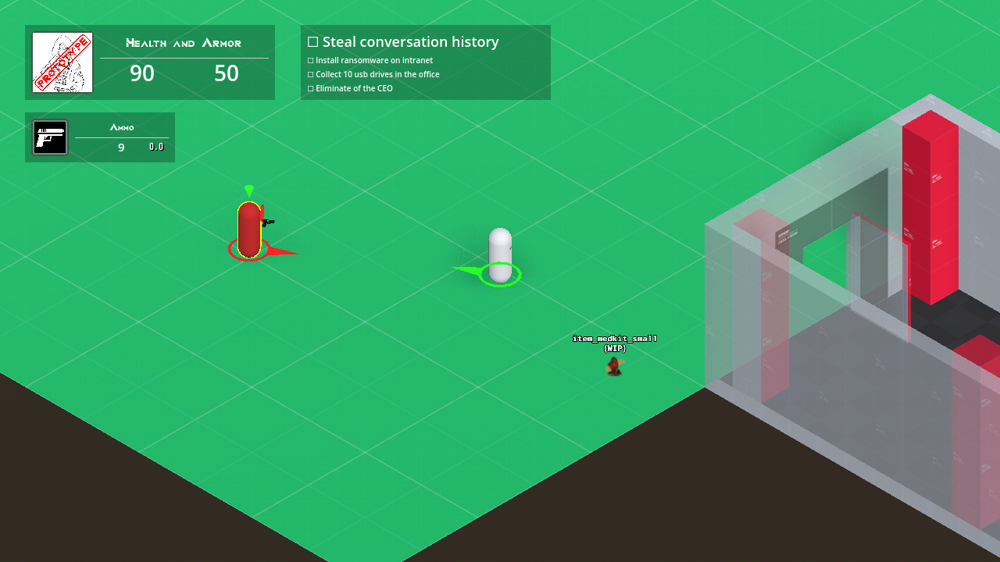

# Project-embers

Second Godot project.
This project was private. It was just set as a public archive as of 2026-01-06.

## What was the goal of the project ?

This project's goal was to get me to make something closer to an actual product by trying to adapt NOT A HERO into a 3D environnement.
The project ceased due to a large technical debt and overscoping for a solo developper. No prototype has been completed.

## Documents of the project

In order to figure out what the game would have been about, I would have had to figure out (or rather remember) the growing pains of NOT A HERO. I wrote a page "<a href="https://github.com/AlexEatDonut/project-embers/blob/main/non-godot-files/documents/Project%20Embers%201%20-%20Criticism%20of%20NOT%20A%20HERO.pdf">Criticism of NOT A HERO</a>" to figure it out.

I then went on to write a "<a href="https://github.com/AlexEatDonut/project-embers/blob/main/non-godot-files/documents/Project%20Embers%202%20-%20Design%20ideas%20Document.pdf">Game design and ideas document</a>". It isn't a formal game design documents, it's closer to a collection of ideas and concepts that went throught my head as I was building the story.

I also created a <a href="https://github.com/AlexEatDonut/project-embers/blob/main/non-godot-files/documents/Project%20Embers%203%20-%20Weapon%20concepts%20and%20stats.pdf">sheet of all weapons</a> I had in mind.

The story and universe in the documents do not fall into the BSD-3-Clause license. Only the game's code and the documents on their own are under the license, not their contents.

## Gallery

### Character concept art by WIP_Tent

### Main Menu

### Devroom

## Addons

<a href="https://github.com/H2xDev/GodotVMF">GodotVMF</a>

<a href="https://github.com/celyk/GPUTrail">GPUTrail</a>

## Project content taken

<a href="https://github.com/mrezai/GodotStairs">GodotStairs</a>

## 3D Models

<a href="https://poly.pizza/m/3To2e7sKmO">Pistol by Zsky [CC-BY] via Poly Pizza</a>

<a href="https://game-icons.net/1x1/john-colburn/pistol-gun.html">Pistol gun icon by John Colburn under CC BY 3.0</a>

<a href="https://sketchfab.com/3d-models/godette-cec6355231284bacba59ccde16a7a729">Godette model by relink - CC BY 4.0 Attribution </a>

## Fonts

<a href="https://www.dafont.com/quantum-4.font?l[]=10&l[]=1">Quantum by Sesohq</a>

<a href="https://www.dafont.com/monofonto.font">Monofonto by Typodermic Fonts </a>

## Sound Effects

<a href="https://freesound.org/people/morganpurkis/sounds/385811/"> Single Pistol Gunshot 3 by morganpurkis</a>

<a href="https://freesound.org/people/MadPanCake/sounds/660768/">Kill Sound/Impact</a> by <a href="https://freesound.org/people/MadPanCake/">MadPanCake</a> | License: <a href="http://creativecommons.org/publicdomain/zero/1.0/">Creative Commons 0</a>

<a href="https://freesound.org/people/Bunny_Clark/sounds/377549/">Pistol Reload.wav</a> by <a href="https://freesound.org/people/Bunny_Clark/">Bunny_Clark</a> | License: <a href="http://creativecommons.org/licenses/by/3.0/">Attribution 3.0</a>

The next 3 sounds have been combined into one sound effect.

<a href="https://freesound.org/people/fastson/sounds/399116/">DryFire_01.wav</a> by <a href="https://freesound.org/people/fastson/">fastson</a> | License: <a href="http://creativecommons.org/licenses/by/3.0/">Attribution 3.0</a>

<a href="https://freesound.org/people/JakLocke/sounds/412294/">Gun trigger pull 1</a> by <a href="https://freesound.org/people/JakLocke/">JakLocke</a> | License: <a href="https://creativecommons.org/licenses/by/4.0/">Attribution 4.0</a>

<a href="https://freesound.org/people/ser%C3%B8t%C5%8Dnin/sounds/725402/">A rifle being dry fired once</a> by <a href="https://freesound.org/people/ser%C3%B8t%C5%8Dnin/">serøtōnin</a> | License: <a href="http://creativecommons.org/publicdomain/zero/1.0/">Creative Commons 0</a>

<a href="https://freesound.org/people/kanaizo/sounds/811838/">Spacey Ambience 4</a> by <a href="https://freesound.org/people/kanaizo/">kanaizo</a> | License: <a href="http://creativecommons.org/publicdomain/zero/1.0/">Creative Commons 0</a>

<a href="https://freesound.org/people/nfsmaster821/sounds/697867/">player_death_ui_show.wav</a> by <a href="https://freesound.org/people/nfsmaster821/">nfsmaster821</a> | License: <a href="http://creativecommons.org/publicdomain/zero/1.0/">Creative Commons 0</a>

<a href="https://kenney.nl/assets/ui-audio">Kenney's UI Audio - 2012 - Creative Commons 0 (CC0)</a>

## Textures

<a href="https://www.kenney.nl/assets/prototype-textures"> Prototype Textures by Kenney, Creative Commons CC0 </a>

<a href="https://www.pngkit.com/bigpic/u2q8w7w7o0y3q8r5/"> "Cities Skylines City Landscape - Buildings At Night Landscape" at pngkit. Unknown copyright. Go see this website first in case you are the owner of the image.</a>

<a href="https://thoseawesomeguys.com/prompts/"> Xelu's free controller and keyboard prompts - Creative Commons 0 (CC0) </a>

Copyright Rémi "AlexEatDonut" Peautre - 2025  
Concept art by Wip_tent  
Hammer editor, software by Valve corporation  
Hammer ++, software extension by Ficool2
